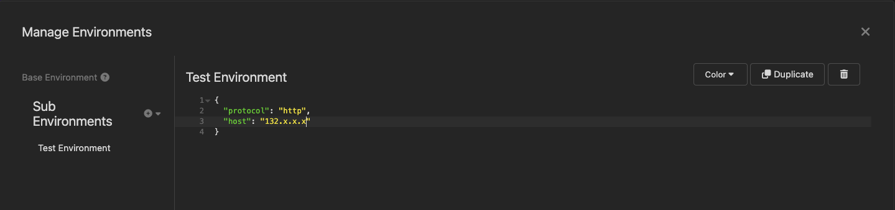
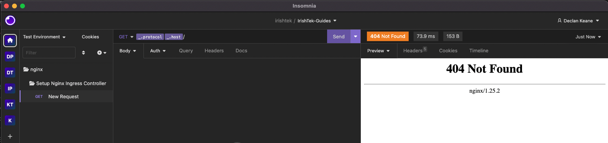
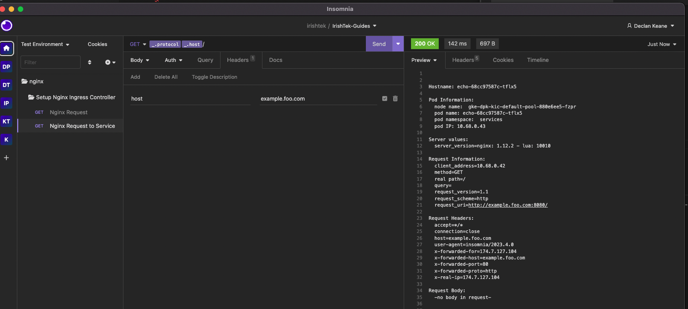

# Install and Testing Nginx Controller

## Install

 

A. Installation:

1. Clone `git clone https://github.com/nginxinc/kubernetes-ingress.git --branch v3.2.1` 
2. Change to helm chart:   `cd kubernetes-ingress/deployments/helm-chart`
3. Create a namespace: `kubectl create ns nginx-ingress`
4. Install `helm install nginx-release oci://ghcr.io/nginxinc/charts/nginx-ingress --version 0.18.1 -f values.yaml -n nginx-ingress`
5. Once it's fully deployed, grab the loadbalancer IP. Run `kubectl get po,svc -n nginx-ingress`. Output should look like this:

```
$ kubectl get po,svc -n nginx-ingress

NAME                                                          READY   STATUS    RESTARTS   AGE
pod/nginx-release-nginx-ingress-controller-58f8454685-dltfl   1/1     Running   0          41s

NAME                                             TYPE           CLUSTER-IP    EXTERNAL-IP   PORT(S)                      AGE
service/nginx-release-nginx-ingress-controller   LoadBalancer   10.72.2.135   132.x.x.x     80:31664/TCP,443:31116/TCP   41s
```

6. Grab the `EXTERNAL-IP` address. We will use this to send a request to the nginx ingress controller. In my example, I will use insomnia. 
7. In the collection, update the environment variable `host`.



8. Then you should send a request, and get a 404 error when sending the request.



The reason for this is because we have deployed or expose an services. We will look at that in the next section.

## Deploy Services and Expose via Nginx Ingress Controller

1. kubectl create ns services
2. kubectl create -f create-echo-service.yaml
3. Run `kubectl get po,svc -n services` to see its running

```
 $ kubectl get po,svc -n services
NAME                        READY   STATUS    RESTARTS   AGE
pod/echo-68cc97587c-tflx5   1/1     Running   0          13s

NAME           TYPE        CLUSTER-IP    EXTERNAL-IP   PORT(S)           AGE
service/echo   ClusterIP   10.72.2.248   <none>        8080/TCP,80/TCP   13s
install-nginx-ing $ 
```

4. kubectl create -f create-echo-ing.yaml
5. Check to see if `ingress` gets created.

```
$ kubectl get ing -n services
NAME                   CLASS   HOSTS             ADDRESS         PORTS   AGE
ingress-echo-service   nginx   example.foo.com   35.222.96.140   80      8s
```

6. In a rest client (like insomnia), send a request through. Make sure `host` header `example.foo.com` is present. 



And that's it, you should now have successfully proxied to your service using the Nginx Ingress Controller

