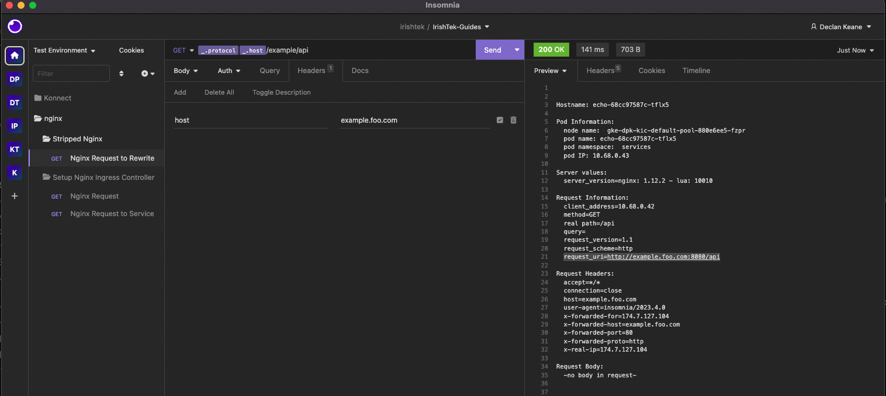

# Stripping a path in nginx

If you haven't set up teh Nginx ingress controller yet or exposed a service, please follow this [guide](../install-nginx-ing/README.md).
In this example, we will look at how to remove a rewrite the incoming path by removing the prefix.

Incoming requests coming in over `/example` will be redirected to `/`. This is useful when wanted to have a prefix for all incoming requests.

## How to use

**Pre-requisites**

1. Nginx Ingress controller is installed
2. You have a Echo service deployed with a svc called `echo`

In order to apply this, just apply the following ingress rule in this directory.

1. kubectl apply -f stripped-ing.yaml

Note: the annotation which is needed is `nginx.org/rewrites: "serviceName=my-kong-kong-proxy rewrite=/"`

```
apiVersion: networking.k8s.io/v1
kind: Ingress
metadata:
  name: ingress-echo-service
  namespace: services
  annotations:
    nginx.org/rewrites: "serviceName=echo rewrite=/"
spec:
  rules:
  - host: example.foo.com
    http:
      paths:
      - path: /example
        pathType: Prefix
        backend:
          service:
            name: echo
            port:
              number: 80
  ingressClassName: nginx
```

2. Send a request through in insomnia



3. The important but to mention is that `/example` is stripped. Incoming request `http://example.foo.com:8080/example/api` is now `http://example.foo.com:8080/api`

